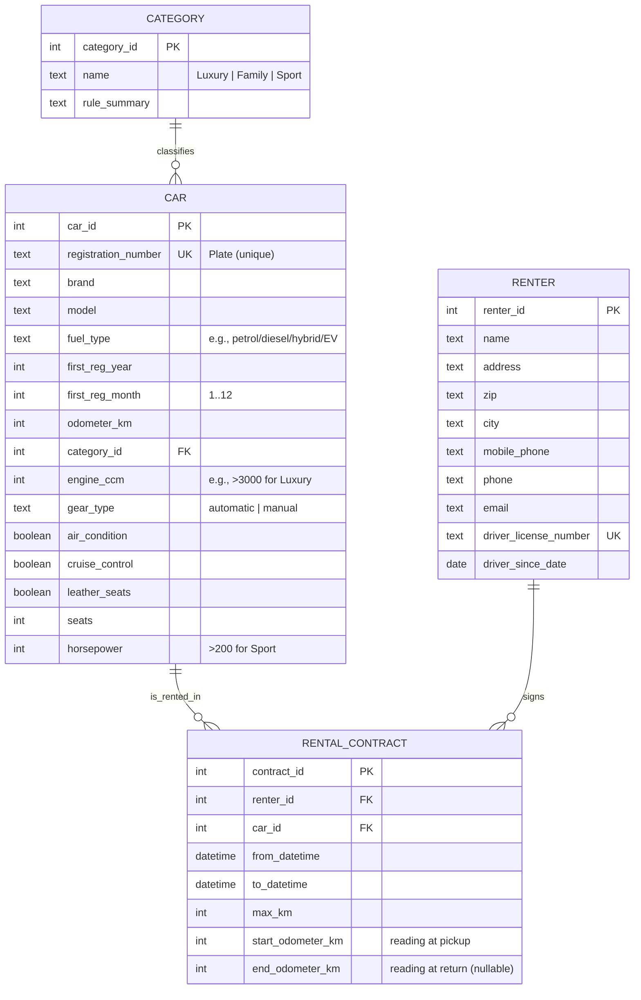

# KailuaKars

```mermaid
erDiagram
  CATEGORY ||--o{ CAR : classifies
  CAR ||--o{ RENTAL_CONTRACT : is_rented_in
  RENTER ||--o{ RENTAL_CONTRACT : signs

  CATEGORY {
    int category_id PK
    text name          "Luxury | Family | Sport"
    text rule_summary
  }

  CAR {
    int car_id PK
    text registration_number UK   "Plate (unique)"
    text brand
    text model
    text fuel_type               "e.g., petrol/diesel/hybrid/EV"
    int first_reg_year
    int first_reg_month          "1..12"
    int odometer_km
    int category_id FK

    int engine_ccm               "e.g., >3000 for Luxury"
    text gear_type               "automatic | manual"
    boolean air_condition
    boolean cruise_control
    boolean leather_seats
    int seats
    int horsepower               ">200 for Sport"
  }

  RENTER {
    int renter_id PK
    text name
    text address
    text zip
    text city
    text mobile_phone
    text phone
    text email
    text driver_license_number UK
    date driver_since_date
  }

  RENTAL_CONTRACT {
    int contract_id PK
    int renter_id FK
    int car_id FK
    datetime from_datetime
    datetime to_datetime
    int max_km
    int start_odometer_km        "reading at pickup"

    int end_odometer_km          "reading at return (nullable)"
  }

```
