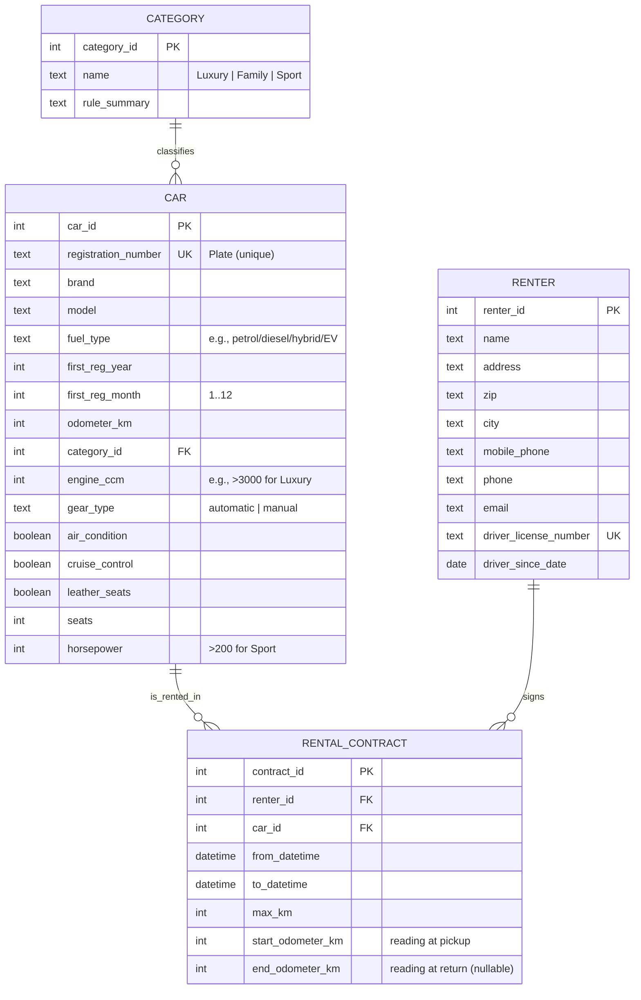

# KailuaKars

# Excercise 1



## Exercise 2 — SQL DDL + Example Data

```sql
BEGIN;


CREATE TABLE category (
  category_id BIGINT GENERATED ALWAYS AS IDENTITY PRIMARY KEY,
  name TEXT NOT NULL UNIQUE
);

CREATE TABLE renter (
  renter_id BIGINT GENERATED ALWAYS AS IDENTITY PRIMARY KEY,
  name TEXT NOT NULL,
  address TEXT NOT NULL,
  zip TEXT NOT NULL,
  city TEXT NOT NULL,
  mobile_phone TEXT,
  phone TEXT,
  email TEXT,
  driver_license_number TEXT NOT NULL UNIQUE,
  driver_since_date DATE NOT NULL
);

CREATE TABLE car (
  car_id BIGINT GENERATED ALWAYS AS IDENTITY PRIMARY KEY,
  registration_number TEXT NOT NULL UNIQUE,
  brand TEXT NOT NULL,
  model TEXT NOT NULL,
  fuel_type TEXT NOT NULL,
  first_reg_year INT NOT NULL,
  first_reg_month INT NOT NULL,
  odometer_km INT NOT NULL,
  engine_ccm INT,
  gear_type TEXT,
  air_condition BOOLEAN,
  cruise_control BOOLEAN,
  leather_seats BOOLEAN,
  seats INT,
  horsepower INT,
  category_id BIGINT NOT NULL REFERENCES category(category_id)
);

CREATE TABLE rental_contract (
  contract_id BIGINT GENERATED ALWAYS AS IDENTITY PRIMARY KEY,
  renter_id BIGINT NOT NULL REFERENCES renter(renter_id),
  car_id BIGINT NOT NULL REFERENCES car(car_id),
  from_datetime TIMESTAMPTZ NOT NULL,
  to_datetime TIMESTAMPTZ NOT NULL,
  max_km INT NOT NULL,
  start_odometer_km INT NOT NULL,
  end_odometer_km INT
);

INSERT INTO category (name) VALUES
  ('Luksus'),
  ('Familie'),
  ('Sport');

INSERT INTO renter
(name, address, zip, city, mobile_phone, phone, email, driver_license_number, driver_since_date)
VALUES
('Maja Nielsen', 'Nørregade 12', '1050', 'København', '+4520103030', NULL, 'maja@example.dk', 'DK-AL-1001', '2014-05-10'),
('Jonas Kristensen', 'Søndergade 7', '8000', 'Aarhus', '+4522334455', NULL, 'jonas@example.dk', 'DK-AL-1002', '2011-03-22'),
('Emma Sørensen', 'Vestergade 5', '5000', 'Odense', '+4522456677', '66112233', 'emma@example.dk', 'DK-AL-1003', '2018-10-01');

INSERT INTO car
(registration_number, brand, model, fuel_type, first_reg_year, first_reg_month, odometer_km,
 engine_ccm, gear_type, air_condition, cruise_control, leather_seats, seats, horsepower, category_id)
VALUES
('DK AB12 345', 'Mercedes', 'E400', 'benzin', 2021, 6, 42000, 3000, 'automatic', TRUE, TRUE, TRUE, 5, 330, (SELECT category_id FROM category WHERE name='Luksus')),
('DK CD34 567', 'Volkswagen','Sharan','diesel', 2019, 9, 98000, 2000, 'manual', TRUE, TRUE, FALSE, 7, 150, (SELECT category_id FROM category WHERE name='Familie')),
('DK EF56 789', 'BMW', 'M240i', 'benzin', 2022, 4, 25000, 3000, 'manual', TRUE, TRUE, FALSE, 4, 340, (SELECT category_id FROM category WHERE name='Sport'));

INSERT INTO rental_contract
(renter_id, car_id, from_datetime, to_datetime, max_km, start_odometer_km, end_odometer_km)
VALUES
((SELECT renter_id FROM renter WHERE driver_license_number='DK-AL-1001'),
 (SELECT car_id FROM car WHERE registration_number='DK AB12 345'),
 NOW() - INTERVAL '20 days', NOW() - INTERVAL '19 days', 300, 42000, 42210),
((SELECT renter_id FROM renter WHERE driver_license_number='DK-AL-1002'),
 (SELECT car_id FROM car WHERE registration_number='DK CD34 567'),
 NOW() - INTERVAL '10 days', NOW() - INTERVAL '9 days', 250, 98000, 98160),
((SELECT renter_id FROM renter WHERE driver_license_number='DK-AL-1003'),
 (SELECT car_id FROM car WHERE registration_number='DK EF56 789'),
 NOW() - INTERVAL '5 days', NOW() - INTERVAL '4 days', 200, 25000, 25140);

COMMIT;
